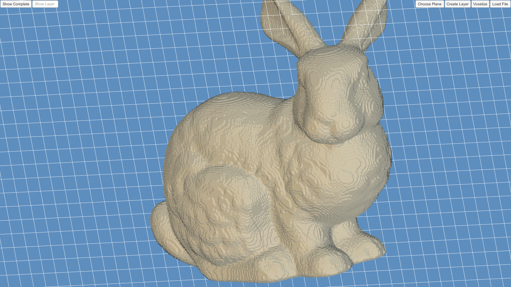
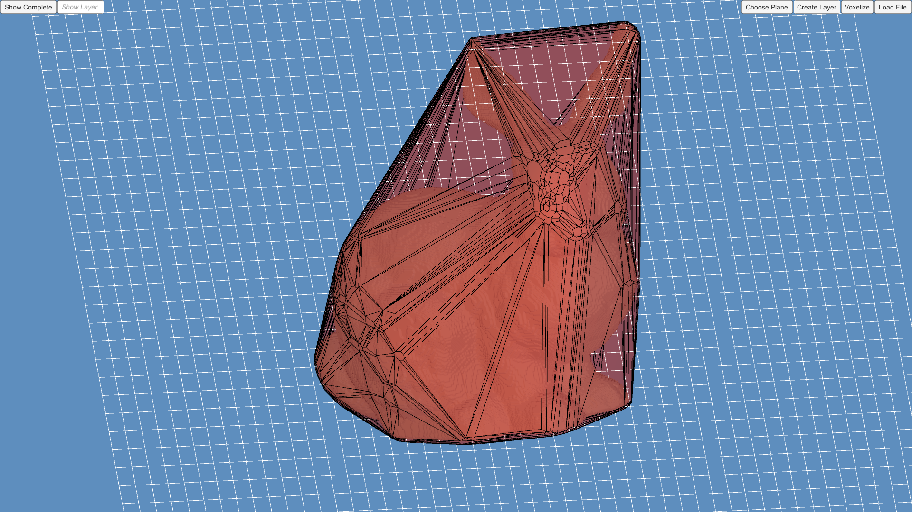
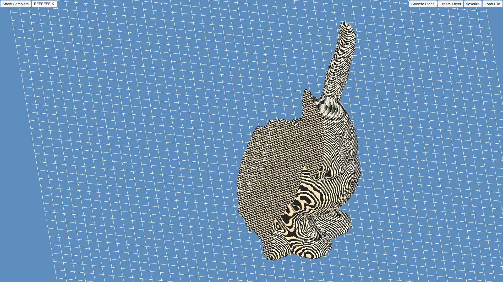

# AMGeometry
Geometry processing for additive manufacturing.  
This software was created to perform geometry processing for additive manufacturing. It consists of two parts; a managed .dll written in C# implementing various geometry processing algorithms and, a Unity3D application which visualizes the results and provides a basic user interface to perform those operations.  
Algorithms for the following geometry processing problems were implemented in the library:  
*	STL file loading
*	3D Triangle mesh voxelization
*	Mesh extraction from a voxel representation
*	Computation of 3D convex hulls
*	Computation of the median axis
*	Computation of the euclidean skeleton
*	Simple layering of the voxel model
*	Simple Path planning operations

The Unity 3D application provides an interface for the following operations:

*	Loading of a 3D mesh from disk.
*	Voxelization of the loaded 3D mesh.
*	Visualizing the computed Convex Hull
*	Layering
*	Visualization of single layers
*	Cutting of the 3D model

## Example
Following are a few example images of the application.  
Figure 1 shows a voxelization of the Stanford Bunny with a Resolution of 512 in every dimension, in the application.  
  
Figure 2 shows the computed convex hull of the Bunny, in the application.  
  
Figure 3 shows a cut through the bunny, so that only half is shone, as well as a layering of it, in the application.  
  
An STL file of the Stanford Bunny is available under the following link:  
https://www.thingiverse.com/thing:11622  

## Control
The Application contains the following GUI elements:  
* Load File: Opens a file selection window that can be used to load a STL Model into the application.  
* Voxelize: Voxelizes the loaded model (requires a model to be loaded). Everything else requires this step to be done.  
* Create Layer: Creates a simple layering of the model starting direction.  
* Choose Plane: Creates a plane which can be used to cut the voxelized model.   
* Show Layer: Visualizes only a specific layer of the voxelized model.  
* Show Complete: Visualizes the complete voxelized model after cutting it or visualizing selected layers.  
* Holding the left mouse button allows rotation of the camera around the center point and holding the right mouse button allows the translation of the camera.  
* When holding the cntrl button the convex hull is visualized and a left click on a face of the hull will select all voxels on it.  
* The plane to cut the voxelized model can be rotate with the q,e,z and x button. The cut will be executed by pressing space.  
* The application can be quit by pressing escape.  
The library contains more functionality which is currently not completely integrated into the application.  

## Installation
In order to use the application download everything in the bin folder and run the BuildExe.exe.  
The library can be used by including the compiled dll.  
## Building
To Build the DLL add all the files from the src/GeometryProcessing to a Visual Studio Managed DLL Project. System.Windows.Forms must be added to the references of the project (It is needed for the DLL loader).  After those steps the DLL can be build.
To add the Unity3D parts to an application copy everything in the src/Assets folder into the respective Unity3D Asset folders of the project or replace completely. The used scene can be found in the scene folder in assets and is called TestScene. Opening it in Unity will allow the use of the Example application. The whole Unity 3D source code can be found in src/Assets/Scripts.
If a changed dll should be used it is only necessary to replace the existing STLLoader.dll file in the Unity3D Asset/Plugin folder with it. The name must be kept to do it without requiring additional changes.

